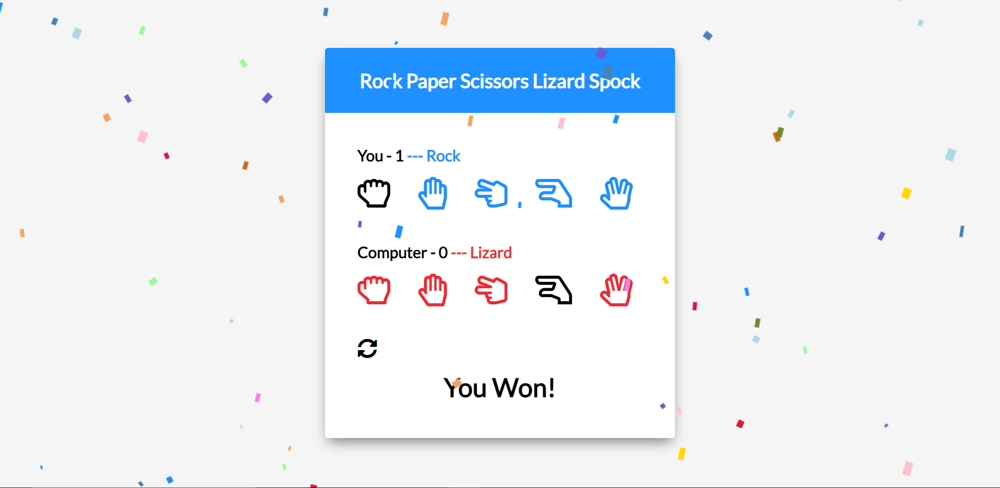

# rockPaperSpock

## Description

This is an example of the game rock, paper, scissors, lizard, spock which was made famous on an episode of the Big Bang Theory. The player makes a choice and the computer picks an item at random. if the player wins confetti streams from the top of the screen.

## Demo

A demo of the project can be found here: https://tod619.github.io/rockPaperSpock/
